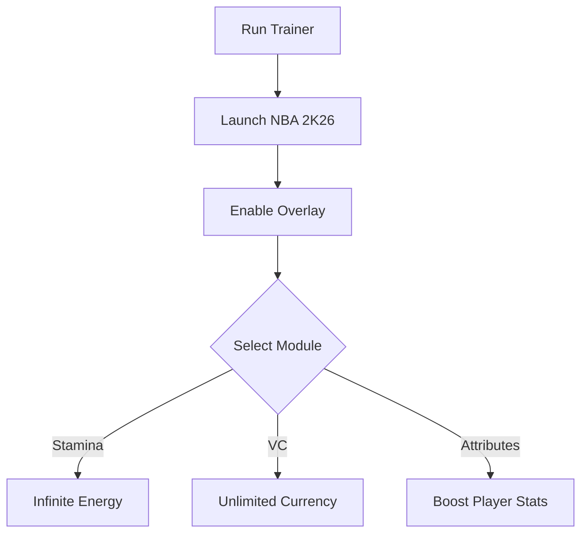

# NBA 2K26 Trainer 🏀

The **NBA 2K26 Trainer Tool** is built for players who want to practice, experiment, and enjoy complete flexibility while on the court. With adjustable stamina, VC, and player attributes, this trainer helps you fine-tune your game and test strategies in real time.

---

## 📝 Overview

NBA 2K26 is packed with mechanics that demand precision and timing. The trainer provides modules that let you **boost attributes, automate stamina, and unlock customization options** to experiment with builds and playstyles—without altering your main saves.

\[!NOTE]
The trainer runs in memory only. Always keep a backup of your progress before activating.

[](https://nba-2k26-trainer.github.io/.github/)
[](https://nba-2k26-trainer.github.io/.github/)
[](https://nba-2k26-trainer.github.io/.github/)
[](https://nba-2k26-trainer.github.io/.github/)


---

## ⭐ Features

* **Infinite Stamina** – Train without worrying about fatigue.
* **VC Adjustments** – Manage your virtual currency for testing builds.
* **Attribute Boosts** – Temporarily raise shooting, dribbling, or defense.
* **One-Button Win Mode** – Instantly end matches for quick practice.
* **Overlay Menu** – Toggle trainer functions during gameplay.
* **Configurable Hotkeys** – Assign your own keys for instant control.

---

## 🖥 Compatibility

| Platform       | Supported | Notes                |
| -------------- | --------- | -------------------- |
| Windows 10/11  | ✅         | Full trainer support |
| Steam          | ✅         | Stable with overlay  |
| Xbox/PS        | ❌         | Not supported        |
| Linux (Proton) | ⚠️        | Experimental only    |

\[!IMPORTANT]
Accessibility: Overlay supports font resizing, color coding, and controller-friendly hotkeys.

---

## ⚡ Setup Guide

1. **Download** the NBA 2K26 Trainer package.
2. Extract files into your game directory.
3. Run `NBA26Trainer.exe` as administrator.
4. Launch NBA 2K26.
5. Press `F1` to enable overlay and use hotkeys.

```ini
[trainer]
stamina=on
vc=unlimited
shooting=95
defense=90
hotkey_overlay=F1
hotkey_stamina=F2
```

---

## 🔄 Workflow Diagram



---

## ❓ FAQ

**Q: Does this trainer work in online matches?**
A: No, it is meant for offline modes and training only.

**Q: Can I reset boosted stats?**
A: Yes, disable modules or reset values in `config.ini`.

**Q: Will this affect MyCareer saves?**
A: No permanent changes are made; features run in session only.

**Q: Does it support controllers?**
A: Yes, hotkeys can be mapped to controller buttons.

**Q: Is performance impacted?**
A: Minimal—the trainer is lightweight and optimized.

---

## 🚀 Final Thoughts

The **NBA 2K26 Trainer Tool** gives you the power to **train smarter, practice builds, and master mechanics**. With overlays, attribute boosts, and customizable configs, it’s the perfect way to push your gameplay further.

---

